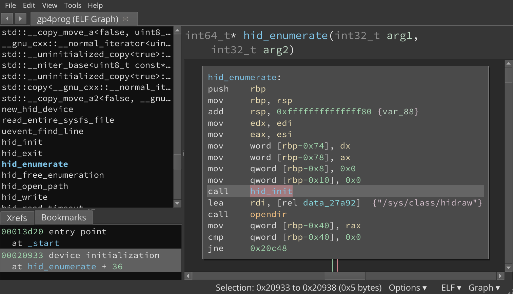

# Binary Ninja XAPI Bookmarks plugin

The XAPI Bookmarks plugin provides a bookmarks tab integrated into Binary Ninja's GUI.

All operations (adding, removing and renaming bookmarks) are done via the context menu of the bookmarks tab.

The metadata format used by this plugin is compatible with the [other one](https://github.com/joshwatson/binaryninja-bookmarks), although they do not synchronize together.

## Requirements

  * [Extended API plugin](https://github.com/whitequark/binja_extended_api)

## License

[0-clause BSD](LICENSE-0BSD.txt)
